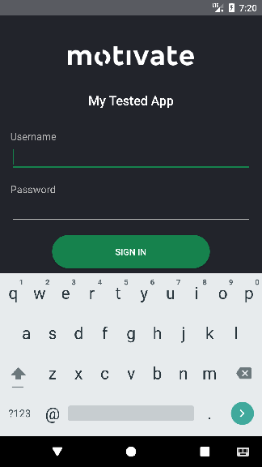

# Android UI testing with espresso and mockito

This android application demonstrates android UI testing.

It has 2 screens:

* the login screen
* the profile page

# Testing

Write integration tests for your application and its use cases.

    Integration testing
    ... software modules are combined and tested as a group

    https://en.wikipedia.org/wiki/Integration_testing

To achieve the most combined software modules tested together write UI tests with Espresso.

This allows you to test if you properly handle button clicks and text inputs. 
This allows you to test if your business rules are respected.
This allows you to test various network errors (timeouts, server errors, client errors)

You should not test by hand when you can write code to do it for you. 
Not only for you but for the next developer that maintains your app.

## Writing tests

In [app/src/androidTest](app/src/androidTest/java/com/mytestedapp) you find:

* Tests for each activity
* Robots to abstract tests and make them look more like english

**Espresso** is for integration tests.
When using espresso all the code should be abstracted by a robot.
See the following links for an idea on how to use espresso.

* [Espresso basics](https://google.github.io/android-testing-support-library/docs/espresso/basics/index.html)
* [Espresso recipes](https://google.github.io/android-testing-support-library/docs/espresso/advanced/)
* [Espresso cheat sheet](https://google.github.io/android-testing-support-library/docs/espresso/cheatsheet/index.html)
* Robots in [app/src/androidTest](app/src/androidTest)

**Mockito** is for mocking the REST API.
When mocking, all the code should be abstracted by 
[InjectionRobot](app/src/androidTest/java/com/mytestedapp/InjectionRobot.java) 
in **app/src/androidTest**.
See the following links for an idea on how to use mockito.

* [How to use mockito](http://site.mockito.org/#how)
* [More about mockito](http://site.mockito.org/#more)
* [Main reference documentation](http://javadoc.io/page/org.mockito/mockito-core/latest/org/mockito/Mockito.html)

### Robots

Robots make the tests look more human readable. They allow tests to say the WHAT. The robot implementation
says the HOW (and the how is ugly espresso functions and ugly mocking details).

For more information see [Instrumentation Testing Robots](https://realm.io/news/kau-jake-wharton-testing-robots/)
by Jake Wharton.

# Run the tests

In Android Studio right click on **app/src/androidTest/java** and choose "Run All Tests"

# Run the app

## Start the server

Assuming you have nodejs and npm installed

    $> cd server
    $> npm install
    $> ./start

## Start the app

In android studio install the app on an emulator.

If you want to run the app on a device you will need to change the IP address of the server.
In [Injection.java](app/src/main/java/com/mytestedapp/Injection.java) change the provideRestService method.
Change the baseUrl to your machine's IP address.

# References

* Instrumentation Testing Robots (https://realm.io/news/kau-jake-wharton-testing-robots/)
* Espresso basics (https://google.github.io/android-testing-support-library/docs/espresso/basics/index.html)
* Espresso recipes (https://google.github.io/android-testing-support-library/docs/espresso/advanced/)
* Espresso cheat sheet (https://google.github.io/android-testing-support-library/docs/espresso/cheatsheet/index.html)
* How to use mockito (http://site.mockito.org/#how)
* More about mockito (http://site.mockito.org/#more)
* Main reference documentation (http://javadoc.io/page/org.mockito/mockito-core/latest/org/mockito/Mockito.html)
